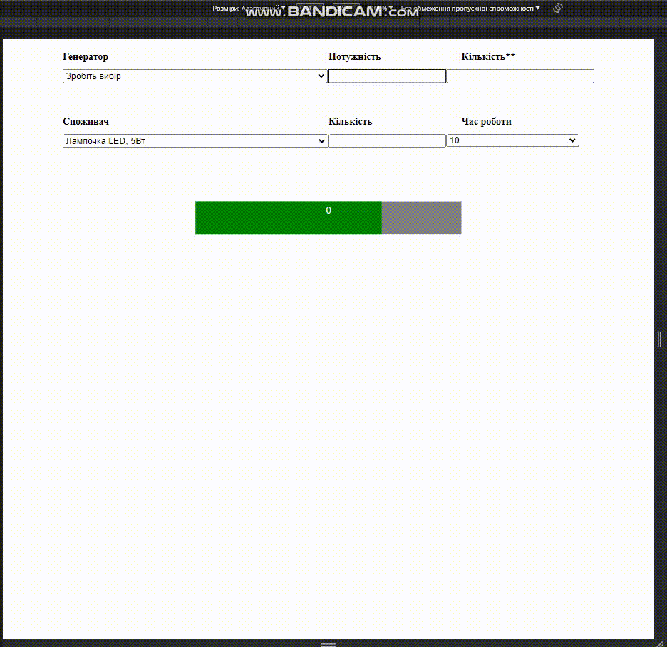

# Project "Generator-Consumer"

This project is a web page that demonstrates the interaction between the user, a generator, and electrical consumers. The user can select the type of generator, specify the quantity, choose a consumer, specify the quantity of consumers, and set the working time. The project then calculates the total power of the generator and displays the progress of generator usage using a progress bar.

## Technologies and Libraries Used

This project utilizes the following technologies and libraries:

- HTML: Used for structuring the web page.
- CSS: Used for styling the elements on the page.
- JavaScript: Used for implementing the interactive functionality of the project.
- Bootstrap: A CSS framework used for responsive and mobile-first web development.

## Functionality

The web page consists of several sections:

### - Generator Section:

Displays the heading "Generator" and allows the user to select the type of generator;

### - Power Section:
Displays the heading "Power" and shows the power of the selected generator;

### - Count Section:
Displays the heading "Count" and allows the user to enter the quantity of generators;

### - Consumer Section:
Displays the heading "Consumer" and allows the user to select the type of consumer;

### - Consumer Count Section:
Displays the heading "Count" and allows the user to enter the quantity of consumers;

### - Time of Work Section:
Displays the heading "Time of work" and allows the user to select the working time;

### - Progress Bar:
Shows the progress of generator usage with a progress bar and a numerical value.

The JavaScript code handles the user input and performs the necessary calculations. It updates the displayed values based on the selected generator, quantity, consumer, quantity of consumers, and working time.

## Usage

To use the project, open the index.html file in a web browser. Select the generator type, enter the quantity of generators, select the consumer type, enter the quantity of consumers, and select the working time. The progress bar will update accordingly, indicating the current usage of the generator.

Note: Ensure that all the required files (index.html, style.css, and script.js) are present in the same directory to properly run the project.

Feel free to modify and customize the project according to your needs.
